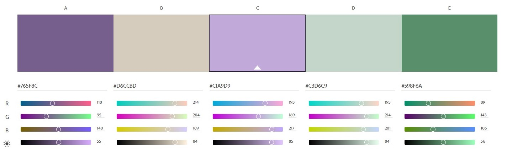

# README

Fatima Mian

# Welcome to my README! 

## Description

This is for The About Me Project, which I have been cumulatively been working on the past few weeks. The project's purpose is to use the skills I learn in Web Dev 1 each week and apply them towards my personal website. As the weeks have gone on, I've learned how to add images and links, paragraphs, lists, embed videos, create a web contact form, add in a navigation bar and how to style appropriately according to my personal tastes. It's been a labor of love, and I'm excited for others to see my hard work!

## Color Scheme

For the color scheme, I wanted an earthy and calming feel for the webpage, so I decided to go with a variety of differnt shades of green and purple, with some white. I thought it would offer a nice contarst while being muted and modern at the same time. 

## License 
